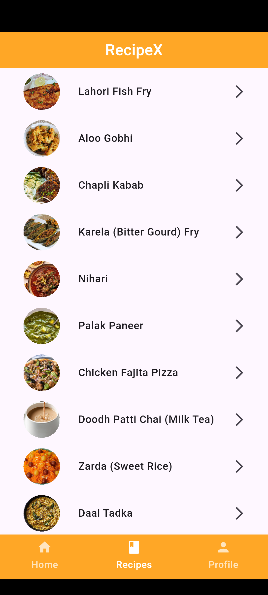
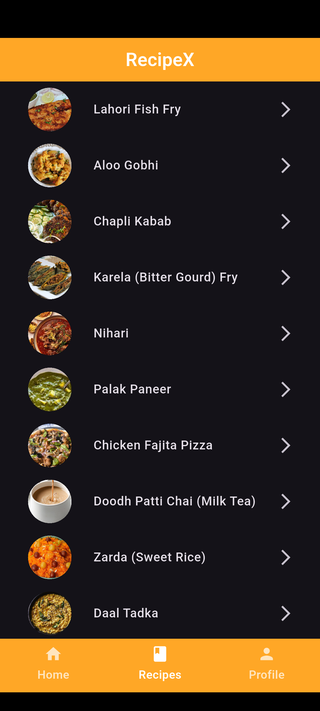
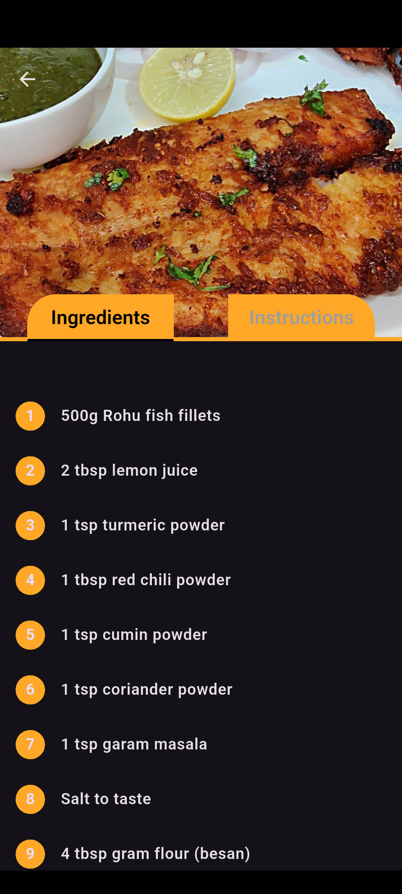

# RecipeX

RecipeX is a Flutter app that allows you to create, manage, and share your favorite recipes with ease. The app supports image upload and cropping using the UCrop library and handles media permissions for a smooth user experience on modern Android devices.

---

## Features

Browse recipes easily 

View and manage your user Profile

Access detailed Recipe information in a dedicated tab

Toggle between Light and Dark themes for comfortable viewing

Simple and clean tab-based navigation

---

## Screenshots

<p align="center">
  
  
  
  
</p>

<p align="center">
  
  
  
  
</p>

---

## Installation

1. Clone the repository:

   ```bash
   git clone https://github.com/yourusername/recipex.git
   cd recipex
